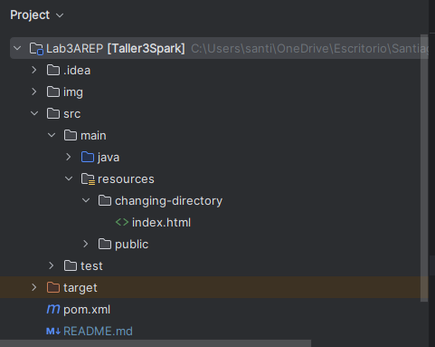

### Escuela Colombiana de Ingeniería

### Arquitecturas Empresariales

#### TALLER 3: MICROFRAMEWORKS WEB

#### Santiago Arévalo Rojas

### Instrucciones para ejecución

Para ejecutar la aplicación se deben seguir los siguientes pasos:
1. Se debe clonar el repositorio de github con el enlace dado en la entrega, el cual es: [https://github.com/santiarojas18/Lab3AREP.git](https://github.com/santiarojas18/Lab3AREP.git)
2. Una vez clonado se debe abrir el proyecto en el IDE de preferencia, en este caso se abrió en IntelliJ:  
     
3. Luego en el directorio src vamos a la clase MyWebServices que es la clase donde estamos ofreciendo los servicios, en la cual se tiene la función main:  
      
4. Al ejecutar la aplicación desde el IDE evidenciamos que el servidor efectivamente está prendido y esperando por peticiones, en esta ocasión iniciamos el servidor por medio del siguiente método que creamos:  
      
      
5. Para la prueba de los servicios GET y POST se realizó una pequeña API en la que se permite agregar un nuevo estudiante por medio de POST y consultar a todos los estudiantes por medio del GET, para probarlo lo haremos por medio de Postman, iniciamos haciendo un GET por medio de la URL [http://localhost:35000/action/students](http://localhost:35000/action/students), en donde evidenciamos que aún no hay estudiantes:  
      
6. Acá también podemos verificar que el Content-Type de la respuesta dada por el servidor fue un "application/json":  
      
7. Esto se logró gracias a que el servidor soporta esta funcionalidad y para especificar el tipo de contenido se hizo de la siguiente manera, donde vemos que en el res llamamos al método type para setearselo:  
      
8. Luego hacemos una petición POST para agregar un nuevo estudiante, en donde el id y el nombre son enviados por query, mostrando que el servidor permite leer los parámetros enviados por query, la petición que se hizo fue [http://localhost:35000/action/students?id=1011320038&name=santi](http://localhost:35000/action/students?id=1011320038&name=santi):  
      
9. Volvemos a consultar a los estudiantes con la petición GET para ver que se haya agregado el estudiante:  
      
10. Para verificar el funcionamiento se realizó una pequeña aplicación para la gestión de los estudiantes a la cual se puede acceder por medio de la URL [http://localhost:35000/student.html](http://localhost:35000/student.html), a la cual apenas ingresamos vemos:  
      
11. Esta app tiene un cliente asíncrono js para probar el POST y GET de la api creada, al dar click en Consult All se hace la petición GET y vemos todos los estudiantes:  
      
12. Para crear un nuevo estudiante ingresamos los datos y damos click al boton Add, en donde hace la petición POST para añadirlo. La aplicación le informa al usuario si se realizó de manera correcta:  
      
13. Ahora volvemos a consultar los estudiantes para verificar que se añadió al último:  
      
14. Por otra parte, accederemos a la aplicación por medio de una máquina virtual que tiene sistema operativo Ubuntu:  
      
15. Consultamos que estén todos los estudiantes que ya habíamos ingresado:  
      
16. E ingresamos uno nuevo:  
      
17. Para volver a consultar:  
      
18. Así mismo, el servidor sigue entregando archivos HTML, CSS, JS e imágenes, como se evidenció en la aplicación anterior. Sin embargo, se pueden realizar las mismas pruebas de anteriores laboratorios, donde se hace peticiones a estos archivo, acá vemos algunos ejemplos:  
      
      
19. Como conocemos, el servidor busca archivos que estén debajo de src/main/resources y por defecto en /public, pero ahora ofrece una nueva funcionalidad, en donde se puede configurar el directorio de donde se leerán los archivos estáticos, para esto, debe llamar al método location, indicando el nuevo directorio, de la siguiente manera:  
      
20. Este fue un cambio exitoso, dentro de este tenemos el archivo index.html:  
      
21. Al consultarlo en el navegador obtenemos el siguiente HTML, que si recordamos, cuando se buscaba en /public el archivo index.html nos retornaba la página de películas:  
      
22. De igual forma si se realiza un cambio no exitoso de directorio, como el siguiente:  
      
23. Nos mostrará mensaje de "Not Found", porque este directorio no existe:  
      

### Información del diseño

* Para poder leer parámetros del query y poder modificar el tipo de respuesta a "application/json", se agregaron dos parámetros al WebServices que son los encargados de manejar la petición y la respuesta:  
      
* Por una parte, para manejar el tema del query, a la hora de llamar el método handle del servicio web en el servidor, se crea un objeto de tipo Request al que se le envía la uri, esta clase Request al crearse separa todos los query que tenga y los guarda en un HashMap donde la llave es el nombre de la variable y el valor es el valor de esta misma, lo hace Request en el método setQueryHash:  
      
* Y esta misma clase Request, ofrece un método llamado queryParams, que tiene como parámetro el nombre del query que quiere consultar su valor:  
      
* De esta forma, el usuario usa el microframework para obtener el query como el siguiente ejemplo, donde llama req.queryParams("id"):  
      
* Por otra parte, para que el usuario del microframework no se encargue de escribir el header de la respuesta, se utiliza el parámetro res, de tipo Response, en la que se realiza el header por defecto en text/html, pero el usuario lo puede modificar a través del método type:  
      
* Así el servidor antes de enviar la respuesta al cliente le obtiene el header y le agrega lo que el usuario del microframework retorna en la creación de la respuesta:  
      
* Por ejemplo, para una respuesta a un GET, el usuario puede cambiar el tipo del contenido de la siguiente forma, con res.type("application/json") y también evidenciamos como el usuario solo tiene que programar lo que quiere que se realice:  
      
* Para poner responder tanto a peticiones GET como POST, se relizaron 2 HashMap para separar los servicios según el request, y así en el servidor, a la hora de responder una solicitud se verifique a cual Hash de servicios obtener el WebService:  
      
* Como vemos, se llama al método getTheAction que se realizó para la modularización, el cual se encarga de llamar al WebService y juntar el header junto con la acción:  
      
* Finalmente, para que el usuario puede cambiar el directorio de donde se lee los archivos estáticos, se crea el atributo locationStaticFiles en el servidor que por defecto es /public:  
      
* En el método que se encarga de leer archivos, se agrega el atributo locationStaticFile:  
      
* Y se crea el método location donde pide por parámetro el nuevo directorio que es utilizado cómo se evidenció en las instrucciones de uso.

### Pruebas y Evaluación

Para validar el funcionamiento se realizaron de nuevo peticiones a la API y externa y además peticiones de archivos al servidor para confirmar que se estuvieran respondiendo de manera adecuada. Para su ejecución basta con dirigirse a src/test/ y ejecutar la clase AppTest. Además de pruebas de funcionamiento como se ven en el apartado de instrucciones para ejecución.
   